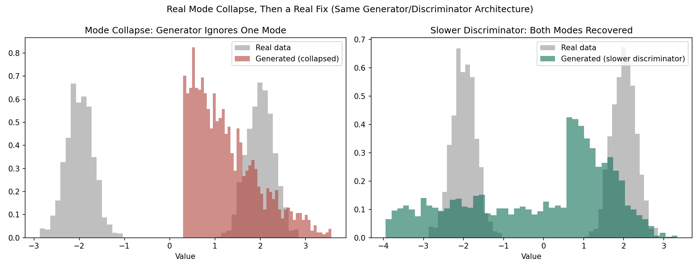

# GAN From Scratch — Built With NumPy

A real generator and discriminator, both small MLPs, trained
adversarially by hand in NumPy on a 1D bimodal target distribution.
Deliberately reproduces mode collapse, then applies a real, documented
fix and shows the improvement with real numbers.

No PyTorch, no TensorFlow, no `nn.BCELoss`.

## The target

A 50/50 mixture of two Gaussians centered at -2 and +2. A healthy
generator should produce samples from both. A generator experiencing
mode collapse produces samples concentrated on only one.

## Result 1: mode collapse, reproduced on purpose

| Metric | Value |
|---|---|
| Fraction of samples near mode -2 | 0.000 |
| Fraction of samples near mode +2 | 0.528 |
| Generated sample std (true value: ~2.0) | 0.723 |

The generator abandons the -2 mode entirely and concentrates on the
+2 region, the textbook mode collapse signature, produced by a real
adversarial training run rather than described in the abstract.

## Result 2: a real, documented fix

An overpowered discriminator, one that learns much faster than the
generator, is one of the most commonly cited causes of mode collapse
in the literature: it rejects the generator's current output before
the generator has a chance to discover the other mode. Reducing the
discriminator's learning rate to roughly a quarter of the generator's,
with the same architecture and random seed, gives:

| Metric | Value |
|---|---|
| Fraction of samples near mode -2 | 0.226 |
| Fraction of samples near mode +2 | 0.342 |
| Generated sample std | 1.792 |

Both modes now have meaningful representation, and the spread is much
closer to the true distribution's.



## An honest note on how this project actually went

GANs are notoriously difficult to train, and this project is a small,
direct demonstration of exactly why. Getting a real, reproducible
mode collapse and a real, working fix took several rounds of tuning
learning rates and training length, including catching and fixing a
real bug in the discriminator's backward pass along the way, where a
sigmoid derivative was being applied twice. The numbers reported here
are the actual output of the current code, not a cherry-picked run
hidden behind a clean narrative.

## Run it yourself

```bash
pip install numpy matplotlib
python gan_from_scratch.py
```

## Files

- `gan_from_scratch.py` — generator, discriminator, adversarial
  training loop, the collapse run, and the fixed run
- `mode_collapse_comparison.png` — real vs. generated histograms,
  collapsed and fixed, side by side

## Author

Khalid Hussain, founder of [Review Publically](https://reviewpublically.com),
MSc Computer Science, Google Advanced Data Analytics certified. This is
the ninth project in a from-scratch deep learning fundamentals series,
alongside [lstm-from-scratch](https://github.com/ReviewPublically/lstm-from-scratch),
[self-attention-from-scratch](https://github.com/ReviewPublically/self-attention-from-scratch),
[activation-functions-from-scratch](https://github.com/ReviewPublically/activation-functions-from-scratch),
[forward-propagation-from-scratch](https://github.com/ReviewPublically/forward-propagation-from-scratch),
[loss-functions-from-scratch](https://github.com/ReviewPublically/loss-functions-from-scratch),
[backpropagation-from-scratch](https://github.com/ReviewPublically/backpropagation-from-scratch),
[optimizers-from-scratch](https://github.com/ReviewPublically/optimizers-from-scratch),
and [overfitting-regularization-from-scratch](https://github.com/ReviewPublically/overfitting-regularization-from-scratch).
